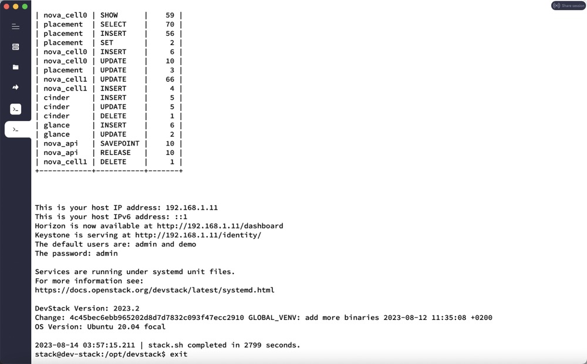
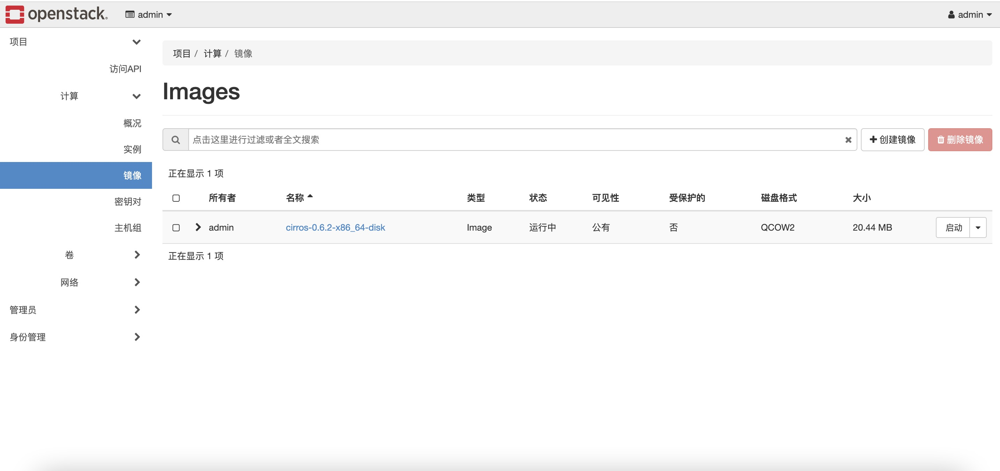

参考官网安装链接：https://docs.openstack.org/devstack/zed/

参考博客：https://blog.csdn.net/woaikeji/article/details/123772104

## 1、环境

系统版本：**Ubuntu-20.04**

配置：**4C 8G**

## 2、更新安装包

```shell
sudo apt-get update                  //更新源
sudo apt-get upgrade                //更新已安装的包
```

## 3、安装基础工具

```shell
apt-get install git
git --version 
apt-get install python3-pip 
pip --version 
```

## 4、设置pip源

```shell
mkdir .pip
sudo vim .pip/pip.conf

[global]
index-url = https://pypi.tuna.tsinghua.edu.cn/simple
trusted-host = pypi.tuna.tsinghua.edu.cn

```

## 5、创建 stack 用户

```shell
# 建立一个新用户账户stack，主目录为/usr/testuser1
# -s：指定用户登入后所使用的shell。默认值为/bin/bash
# -m: 如果主目录不存在则自动创建

sudo useradd -s /bin/bash -d /opt/stack -m stack
echo “stack ALL=(ALL) NOPASSWD: ALL” | sudo tee /etc/sudoers.d/stack   # 授予 stack 用户 sudo 权限
```


## 6、切换至 stack 用户

```shell
sudo su - stack
```

## 7、克隆安装包

```shell
sudo git clone https://github.com/openstack-dev/devstack.git /opt/devstack
```


## 8、设置权限

```
sudo chown -R stack:stack /opt/devstack
sudo chmod -R 777 /opt/devstack
```


## 9、创建 local.conf 配置文件

```shell
cd /opt/devstack

stack@dev-stack:/opt/devstack$ cat local.conf  

[[local|localrc]]
ADMIN_PASSWORD=admin
DATABASE_PASSWORD=admin
RABBIT_PASSWORD=admin
SERVICE_PASSWORD=admin
#Use mirror
GIT_BASE=http://git.trystack.cn
NOVNC_REPO=http://git.trystack.cn/kanaka/noVNC.git
SPICE_REPO=http://git.trystack.cn/git/spice/spice-html5.git
```


## 10、运行安装脚本

```
sudo su - stack  
./stack.sh
```

**如果运行出现错误，请根据提示改正，再次执行./stack.sh时需要先清理错误配置，命令如下：**

```
./unstack.sh
./clean.sh
```

成功如下图：




Web 访问如下：




## 11、命令行使用

```shell
stack@dev-stack:/opt/devstack$ pwd
/opt/devstack

# openrc 配置登录认证信息，以使用命令行工具，如nova, glance等

stack@dev-stack:/opt/devstack$ ll |grep openrc 
-rwxrwxrwx  1 stack stack  4038 Aug 14 11:08 openrc*

# source openrc [username] [tenantname]

stack@dev-stack:/opt/devstack$ 
```

要在devstack目录下运行，当报告：WARNING: setting legacy OS_TENANT_NAME to support cli tools.时即表示可以正常使用）：
