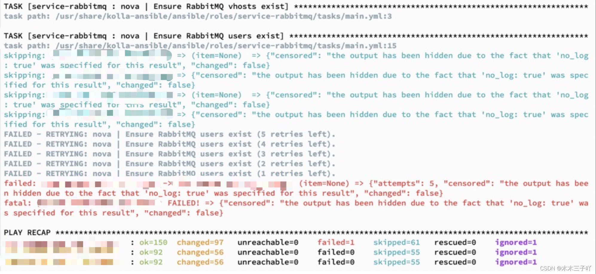
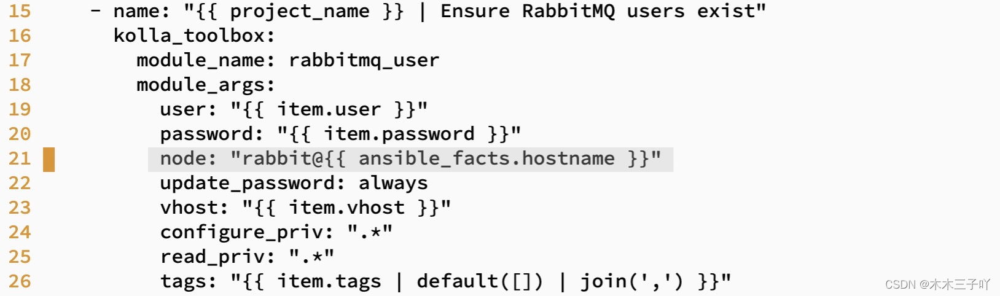

## 问题现象：

环境：系统 centos7，通过 kolla-ansible 部署 train 版 Openstack，在 deploy 部署阶段执行到任务 

TASK [service-rabbitmq : nova | Ensure RabbitMQ users exist] 报错 FAILED - RETRYING: nova | Ensure RabbitMQ users exist (5 retries left). 详情如下图：




## 问题分析：

查询相关博客给出的解决办法是清理部署环境，重新部署。但我清理多次部署还是会报错如上图。

后谷歌相关资料，发现很多人部署都出现过这个问题，其实是 kolla-ansible 的一个bug，需要修改一下配置文件。并且This issue was fixed in the openstack/kolla-ansible 14.0.0.0rc1 release candidate.

[原文链接](https://bugs.launchpad.net/kolla-ansible/+bug/1946506)


## 解决办法：


```shell
vi /usr/share/kolla-ansible/ansible/roles/service-rabbitmq/tasks/main.yml 

# 在第 21 行 添加如下代码

node: "rabbit@{{ ansible_facts.hostname }}"
```

如图：




此时再去执行 deploy，安装成功 

