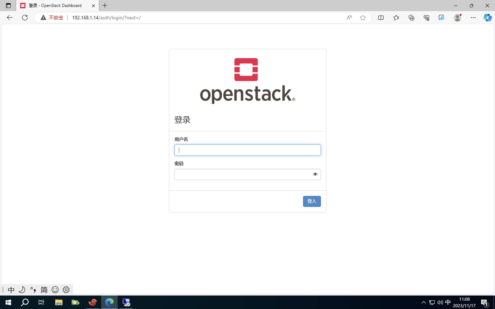

## 一、基础环境配置

### 1.1、修改主机名 & hosts映射

填写 /etc/hosts（所有节点）

```shell
[root@controller ~]# cat /etc/hosts
127.0.0.1   localhost localhost.localdomain localhost4 localhost4.localdomain4
::1         localhost localhost.localdomain localhost6 localhost6.localdomain6
192.168.1.14 controller
192.168.1.8 compute
192.168.1.10 storage
[root@controller ~]# 
```


### 1.2、yum源设置&节点免密

```shell
 # 替换yum源为阿里源
 sed -e 's|^mirrorlist=|#mirrorlist=|g' \
         -e 's|^#baseurl=http://mirror.centos.org/$contentdir|baseurl=https://mirrors.ustc.edu.cn/centos|g' \
         -i.bak \
         /etc/yum.repos.d/CentOS-Stream-AppStream.repo \
         /etc/yum.repos.d/CentOS-Stream-BaseOS.repo \
         /etc/yum.repos.d/CentOS-Stream-Extras.repo \
         /etc/yum.repos.d/CentOS-Stream-PowerTools.repo


# 清空之前的yum源
yum clean all 
# 生成缓存
yum makecache

```

免密设置

```shell
# 控制节点
ssh-keygen
ssh-copy-id compute
ssh-copy-id controller
ssh-copy-id storage
```


### 1.3、禁用防火墙 && 打开centos路由转发

```shell
systemctl stop firewalld && systemctl disable firewalld && setenforce 0
echo "net.ipv4.ip_forward = 1" >>/etc/sysctl.conf && sysctl -p /etc/sysctl.conf
```


### 1.4、安装 openstack 软件仓库

```shell
dnf install -y centos-release-openstack-yoga
dnf -y update
```


### 1.5、安装 docker

Docker CE 安装需要一个包 containerd.io。来自 Docker 的这个 containerd.io 包包括 runc，此 runc 与 Podman 和 Skopeo 所需的 RHEL/CentOS 8 本机 runc 包冲突 

```shell
# 安装 Podman 
sudo dnf install podman -y

# 测试podman是否成功
sudo podman run hello-world

# 安装docker仓库并禁用它
sudo dnf config-manager --add-repo=https://download.docker.com/linux/centos/docker-ce.repo
sudo dnf config-manager --set-disabled docker

# 安装 Docker containerd.io 
sudo rpm --install --nodeps --replacefiles --excludepath=/usr/bin/runc https://download.docker.com/linux/centos/8/x86_64/stable/Packages/containerd.io-1.6.9-3.1.el8.x86_64.rpm

# 安装 Docker CE，只为这个命令启用它的 repo
sudo dnf install --enablerepo=docker-ce-stable docker-ce -y

# 启用docker
sudo systemctl enable --now docker

# 测试docker
sudo docker run hello-world

# 测试podman
sudo podman run hello-world

# 更新
sudo dnf update
```


## 二、部署节点环境准备（openstack）


### 2.1、安装 Python 构建依赖项

```shell
dnf install -y git  python3 sshpass tmux python3-devel libffi-devel gcc openssl-devel python3-libselinux python3-netaddr
```


### 2.2、获取部署脚本

```shell
mkdir -p /opt/openstack && cd /opt/openstack      # 创建安装目录
git clone -b stable/yoga https://opendev.org/openstack/kolla-ansible.git  # openstack
git clone -b stable-6.0 https://github.com/ceph/ceph-ansible.git  # Ceph
```


### 2.3、生成kolla-ansible虚拟环境

```shell
python3 -m venv /opt/openstack/venv
source /opt/openstack/venv/bin/activate   # 激活虚拟环境
```


### 2.4、安装 pip & Ansible

```shell
pip install -U pip 
pip install 'ansible>=4,<6'
```


### 2.5、检查openstack版本

```shell
cd /opt/openstack/kolla-ansible
git checkout stable/yoga
```


### 2.6、安装相关依赖

```shell
pip install .
cd /opt/openstack/
```


### 2.7、创建/etc/kolla目录

```shell
mkdir -p /etc/kolla
```


### 2.8、复制配置文件

```shell
cp ./venv/share/kolla-ansible/etc_examples/kolla/* /etc/kolla
cp ./kolla-ansible/ansible/inventory/multinode ./inventory
```


### 2.9、安装 ansible galaxy 依赖

```shell
kolla-ansible install-deps
```


### 2.10、修改 ansible 配置文件

```shell
mkdir -p /etc/ansible
cat > /etc/ansible/ansible.cfg<<EOF
[defaults]
host_key_checking=False
pipelining=True
forks=100
log_path = /var/log/openstack-ansible.log

[privilege_escalation]
become = True
EOF
```


### 2.11、修改配置文件

```shell
vi ./inventory     # 修改inventory文件

[all:vars]

#Host user name and password must be required if no ssh trust
ansible_connection=ssh

#Using password
ansible_user=root
ansible_ssh_pass=abcdABCD123

# These initial groups are the only groups required to be modified. The
# additional groups are for more control of the environment.
[control]
# These hostname must be resolvable from your deployment host
controller
compute
storage

# The above can also be specified as follows:
#control[01:03]     ansible_user=kolla

# The network nodes are where your l3-agent and loadbalancers will run
# This can be the same as a host in the control group
[network]
controller
compute
storage

[compute]
controller
compute
storage

[monitoring]
controller

# When compute nodes and control nodes use different interfaces,
# you need to comment out "api_interface" and other interfaces from the globals.yml
# and specify like below:
#compute01 neutron_external_interface=eth0 api_interface=em1 storage_interface=em1 tunnel_interface=em1


[deployment]
localhost       ansible_connection=local

[storage:children]
control

[mons:children]
control

[osds:children]
compute

[grafana-server:children]
mons

[baremetal:children]


# 编辑安装文件
(ceph-venv) [root@controller openstack]# cat openstack.yml 
kolla_base_distro: "centos"
kolla_install_type: "source"
network_interface: "eth0"
neutron_external_interface: "eth1"
kolla_internal_vip_address: "192.168.1.14"
enable_cinder: "yes"
enable_cinder_backup: "yes"
enable_fluentd: "yes"
enable_openvswitch: "yes"
enable_heat: "no"
enable_prometheus: "yes"
enable_grafana: "yes"
#####实例高可用
enable_masakari: "yes"
enable_hacluster: "yes"

#####trunk
enable_neutron_agent_ha: "yes"
enable_neutron_trunk: "yes"
enable_neutron_segments: "yes"


vi /etc/kolla/globals.yml     # 添加占位符

dummy:
```


### 2.12、生成kolla 密码

```shell
kolla-genpwd
```


### 2.13、检查主机连通性

```shell
ansible -i ./inventory all -m ping
```


### 2.14、节点初始化 & 节点检查

```shell
kolla-ansible -i ./inventory -e @/opt/openstack/openstack.yml bootstrap-servers -vv

# 获取安装镜像
kolla-ansible -i inventory -e @/opt/openstack/openstack.yml pull -vv

kolla-ansible -i /opt/openstack/inventory -e @/opt/openstack/openstack.yml prechecks -vv 
```


## 三、Ceph 环境准备

使用 ceph-ansible 部署 ceph 分布式存储

```shell
cd ceph-ansible
git checkout stable-6.0
```

### 3.1、创建Ceph虚拟环境

```shell
python3 -m venv /opt/openstack/ceph-venv
source /opt/openstack/ceph-venv/bin/activate

# 更新pip
pip install -U pip  -i https://mirrors.aliyun.com/pypi/simple

# 下载ansible
pip install -r /opt/openstack/ceph-ansible/requirements.txt  -i https://mirrors.aliyun.com/pypi/simple
```


### 3.2、安装 ceph-ansible 依赖项

```shell
cd ceph-ansible
ansible-galaxy install -r requirements.yml
```


### 3.3、填写 ceph.yml 配置文件

```shell
cat >> /opt/openstack/ceph.yml <<EOF
cephx: true

ceph_origin: distro
configure_firewall: false

osd_scenario: lvm
osd_objectstore: bluestore
osd_auto_discovery: false
# 显式设置 db 空间大小，单位为 bytes，默认 -1 为平分空间
block_db_size: -1

# 根据实际情况填写
public_network: "192.168.1.0/24"
cluster_network: "192.168.2.0/24"
monitor_interface: eth0
ntp_service_enabled: false


#dashboard_enabled: false
dashboard_admin_password: 12345678
grafana_admin_password: 12345678

crush_rule_config: true

#crush_rule_hdd:
#  name: hdd
#  root: default
#  type: host
#  class: hdd
#  default: false


crush_rule_ssd:
  name: ssd
  root: default
  type: host
  default: false
  class: ssd

lvm_volumes:
  - data: /dev/vdf
    crush_device_class: ssd
#  - data: /dev/vde
#    crush_device_class: hdd


crush_rules:
#  - "{{ crush_rule_hdd }}"
  - "{{ crush_rule_ssd }}"

openstack_config: true
#openstack_glance_pool:
#  name: "images"
#  application: "rbd"
#  pg_autoscale_mode: "on"
#  target_size_ratio: 0.2
#openstack_nova_pool:
#  name: "vms"
#  application: "rbd" # 存储类型rbd块存储
#  pg_autoscale_mode: "on" # pg_autoscale模块将根据pool的实际容量调整pg_num数。
#  target_size_ratio: 0.1 # 设置某个pool占用的集群容量百分比
# ssd pool
openstack_cinder_ssd_pool:
  name: "ssd-volumes"
  rule_name: "{{ crush_rule_ssd.name }}"
  application: "rbd"
  pg_autoscale_mode: "on"
  target_size_ratio: 1.0
#openstack_cinder_hdd_pool:
#  name: "hdd-volumes"
#  rule_name: "{{ crush_rule_hdd.name }}"
#  application: "rbd"
#  pg_autoscale_mode: "on"
#  target_size_ratio: 1.0
openstack_pools:
#  - "{{ openstack_glance_pool }}"
#  - "{{ openstack_cinder_hdd_pool }}"
#  - "{{ openstack_nova_pool }}"
  - "{{ openstack_cinder_ssd_pool }}"
openstack_keys:
  - { name: client.glance, caps: { mon: "profile rbd", osd: "profile rbd"}, mode: "0600" }
  - { name: client.cinder, caps: { mon: "profile rbd", osd: "profile rbd"}, mode: "0600" }
EOF
```


### 3.4、部署Ceph

```shell
cd /opt/openstack/ceph-ansible
ansible-playbook  -i /opt/openstack/inventory   site.yml.sample  -e @/opt/openstack/ceph.yml -vvvv
```

安装好如下图：


## 四、配置ceph与openstack 服务对接

### 4.1、配置ceph与openstack 服务对接

```shell
# 配置ceph与openstack glance服务对接
# 创建 /etc/kolla/config/glance 目录
mkdir -p /etc/kolla/config/glance
# copyceph.client.glance.keyring 到/etc/kolla/config/glance/ 与glance服务对接
cp /etc/ceph/ceph.client.glance.keyring /etc/kolla/config/glance/
# 复制ceph配置文件到/etc/kolla/config/glance/
cp /etc/ceph/ceph.conf /etc/kolla/config/glance/
# 创建cinder目录
mkdir -p /etc/kolla/config/cinder/cinder-volume
# 编辑cinder文件
vim /etc/kolla/config/cinder/cinder-volume.conf
[DEFAULT]
enabled_backends=hdd
#enabled_backends=hdd,ssd

# 启用hdd配置
[hdd]
rbd_ceph_conf = /etc/ceph/ceph.conf
rbd_user = cinder
backend_host = rbd:hdd_volumes
rbd_pool = hdd-volumes
volume_backend_name = hdd
volume_driver = cinder.volume.drivers.rbd.RBDDriver
rbd_secret_uuid = XXX 
# 查看 /etc/kolla/passwords.yml 中对应的 cinder_rbd_secret_uuid

#[ssd]
#rbd_ceph_conf = /etc/ceph/ceph.conf
#rbd_user = cinder
#backend_host = rbd:ssd_volumes
#rbd_pool = ssd-volumes
#volume_backend_name = ssd
#volume_driver = cinder.volume.drivers.rbd.RBDDriver
#rbd_secret_uuid = XXX 
# 查看 /etc/kolla/passwords.yml 中对应的 cinder_rbd_secret_uuid


# 配置ceph与openstack cinder 服务对接
cp /etc/ceph/ceph.client.cinder.keyring /etc/kolla/config/cinder/cinder-volume
cp /etc/ceph/ceph.conf /etc/kolla/config/cinder/
# 配置ceph与openstack nova 服务对接
mkdir -p /etc/kolla/config/nova
cp /etc/ceph/ceph.client.cinder.keyring /etc/kolla/config/nova/
cp /etc/ceph/ceph.conf /etc/kolla/config/nova/


# 开启 Glance 、 Cinder 和 Nova 的后端 Ceph 功能
cat >>  /opt/openstack/openstack.yml <<EOF
glance_backend_ceph: "yes"
cinder_backend_ceph: "yes"
nova_backend_ceph: "yes"
EOF
```

### 4.2、ml2配置

```shell
# 此步骤是为了可以使用vlan网络，因为默认使用vxlan
mkdir /etc/kolla/config/neutron

vim /etc/kolla/config/neutron/ml2_conf.ini
[ml2_type_vlan]
network_vlan_ranges = physnet1:1:4094
```


## 五、部署kolla-openstack

### 5.1、环境正式部署

```shell
# 基础检查
kolla-ansible -i /opt/openstack/inventory -e @/opt/openstack/openstack.yml prechecks -vv 

# 正式部署
kolla-ansible -i /opt/openstack/inventory -e @/opt/openstack/openstack.yml deploy -vv
```


```shell
# 发布部署
kolla-ansible -i /opt/openstack/inventory -e @/opt/openstack/openstack.yml post-deploy -vv
```




### 5.2、安装 openstack-client

```
pip install python-openstackclient -c https://releases.openstack.org/constraints/upper/yoga
(-c 指定约束版本)

pip install python-neutronclient   -c https://releases.openstack.org/constraints/upper/yoga  ## trunk命令
```


### 5.3、使用openstack

```shell
source /etc/kolla/admin-openrc.sh
```


kolla安装openstack-Yoga版对接Ceph部署完成。


### 5.4、访问 prometheus 监控服务

查询 prometheus 和 grafana 服务端口


后续可对相关服务进行监控展示
