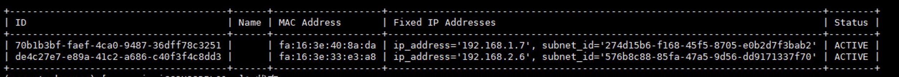
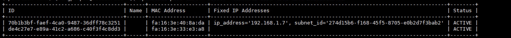

当我们想要给云主机添加第二块无 IP 的网卡时，需要云主机挂载上新的网卡接口，但是在挂载接口时，时常会dhcp自动的分配一个ip地址，此时我们需要给他删除掉分配的地址，让他成为一个没有IP地址的网卡


找出目标云主机的 port 列表（此处我需要移除 IP的是 192.168.2.6 ）

```shell 
openstack port list --server  1317ada5-231c-417f-9cc8-b6867591457e
```




```shell
openstack  server  remove port $server_id  $port_id
openstack port set $port_id   --no-fixed-ip
openstack  server  add port $server_id  $port_id
openstack port list --server  41350a43-bd76-45fc-92ff-283e01c124fa
```


