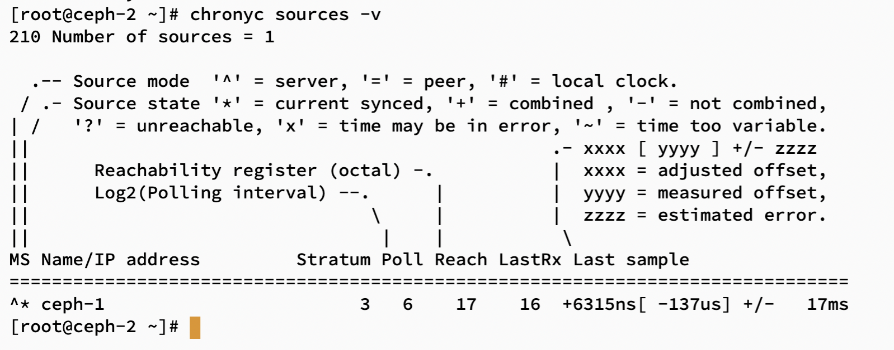
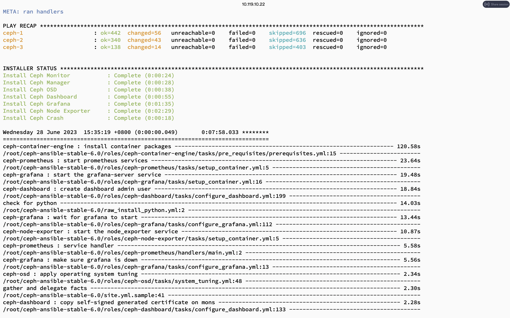
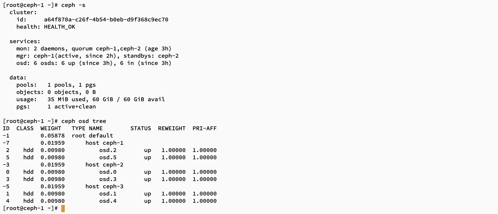

## 安装环境：

| 主机名 | os       | 角色        | public_ip    | cluster_ip   | osd磁盘 |
| ------ | -------- | ----------- | ------------ | ------------ | ------- |
| Ceph-1 | CentOS 8 | Mon,mgr,osd | 192.168.1.11 | 192.168.2.10 | vdb/vdc |
| Ceph-2 | CentOS 8 | Mon,mgr,osd | 192.168.1.14 | 192.168.2.12 | vdb/vdc |
| Ceph-2 | CentOS 8 | osd         | 192.168.1.5  | 192.168.2.8  | vdb/vdc |


## 1、修改主机名 

```shell
hostnamectl set-hostname ceph-1
hostnamectl set-hostname ceph-2
hostnamectl set-hostname ceph-3
```


## 2、修改 /etc/hosts 文件

```shell
cat >>/etc/hosts<<EOF
192.168.1.11 ceph-1
192.168.1.14 ceph-2
192.168.1.5 ceph-3
EOF
```


## 3、节点免密

```shell
[root@ceph-1 ~]# ssh-keygen
Generating public/private rsa key pair.
Enter file in which to save the key (/root/.ssh/id_rsa): 
Enter passphrase (empty for no passphrase): 
Enter same passphrase again: 
Your identification has been saved in /root/.ssh/id_rsa.
Your public key has been saved in /root/.ssh/id_rsa.pub.
The key fingerprint is:
SHA256:3Rwq/ejDgnugo4sur6AldSsfRQa1mMzI5EgHmEVwh/8 root@ceph-1
The key's randomart image is:
+---[RSA 3072]----+
|oB*oo..          |
|+*o= + .         |
|. +.= +     .    |
|    .o   o + .   |
|  . ... S + o    |
| . . oE  . o     |
|o o o. o .. .    |
|++ oo.. o.o      |
|*++o...o ...     |
+----[SHA256]-----+
[root@ceph-1 ~]# ssh-copy-id 192.168.1.14
[root@ceph-1 ~]# ssh-copy-id 192.168.1.5
```


## 4、修改yum 源

CentOS 8仓库已经于2022年关闭了,yum 源无法正常使用，否则安装会报错  “仓库 'appstream' 下载元数据失败 : Cannot prepare internal mirrorlist:”

```shell
cd /etc/yum.repos.d/
mkdir bak
mv CentOS-Linux-* bak/
wget -O /etc/yum.repos.d/CentOS-Base.repo https://mirrors.aliyun.com/repo/Centos-vault-8.5.2111.repo
yum clean all
yum makecache
```


## 5、配置节点时间同步

```shell
dnf -y install chrony
systemctl start chronyd

[root@ceph-1 ~]# cat /etc/chrony.conf  |grep -v  "^#" |grep -v "^$"
pool 2.centos.pool.ntp.org iburst
server ntp.aliyun.com iburst
driftfile /var/lib/chrony/drift
makestep 1.0 3
rtcsync
allow 192.168.1.0/24
keyfile /etc/chrony.keys
leapsectz right/UTC
logdir /var/log/chrony

[root@ceph-2 .ssh]# cat /etc/chrony.conf  |grep -v  "^#" |grep -v "^$"
server  192.168.1.11  iburst
driftfile /var/lib/chrony/drift
makestep 1.0 3
rtcsync
keyfile /etc/chrony.keys
leapsectz right/UTC
logdir /var/log/chrony

节点3与节点2配置文件/etc/chrony.conf 内容一样
```

验证时间同步状态

```shell
chronyc sources -v
```




## 6、获取ceph-ansible部署包

```shell
wget https://github.com/ceph/ceph-ansible/archive/refs/heads/stable-6.0.zip -O ceph-ansible-stable-6.0.zip
unzip ceph-ansible-stable-6.0.zip
cd ceph-ansible-stable-6.0
pip install -r requirements.txt	 # 进行安装ansible和其它依赖
```


## 7、定义主机清单hosts文件

```shell
cd ceph-ansible-stable-6.0/
vi hosts

[mons] 
ceph-1
ceph-2

[mgrs]
ceph-1
ceph-2

[osds]
ceph-1
ceph-2
ceph-3

[monitoring]
ceph-1
ceph-2
```


## 8、配置ceph安装参数

安装参数详解见另一篇文章:

```shell
cd ceph-ansible-stable-6.0/group_vars/
mv all.yml.sample all.yml
mv osds.yml.sample osds.yml	

[root@ceph-1 group_vars]# cat all.yml 
---
dummy:
mon_group_name: mons
osd_group_name: osds
mgr_group_name: mgrs
monitoring_group_name: monitoring
ceph_origin: repository
ceph_repository: community
ceph_mirror: https://mirrors.tuna.tsinghua.edu.cn/ceph/         # ceph安装源
ceph_stable_key: https://mirrors.tuna.tsinghua.edu.cn/ceph/keys/release.asc
ceph_stable_release: pacific    
monitor_interface: ens3   # ceph-mon节点服务监听网卡
monitor_address_block: 192.168.1.0/24   # ceph-mon节点服务监听地址所在网段
ip_version: ipv4
public_network: 192.168.1.0/24  # public-netework子网
cluster_network: 192.168.2.0/24 # cluster-network子网
osd_objectstore: bluestore              # osd使用的存储后端
dashboard_enabled: True         # 启用ceph-dashboard
dashboard_admin_user: admin     # ceph-dashboard用户名和密码
dashboard_admin_password: Admin@123
grafana_admin_user: admin       # grafana用户名和密码
grafana_admin_password: admin


[root@ceph-1 group_vars]# cat osds.yml 
---
dummy:
devices:        # 每个节点上用作osd的磁盘
  - /dev/vdb
  - /dev/vdc
osd_auto_discovery: false       

```


## 9、开始部署

```shell
cd ceph-ansible-stable-6.0/
ansible-playbook -i hosts site.yml.sample  -vv 
```




## 10、验证集群状态




## 11、删除集群


```shell
ansible-playbook -vv -i hosts infrastructure-playbooks/purge-cluster.yml
```

