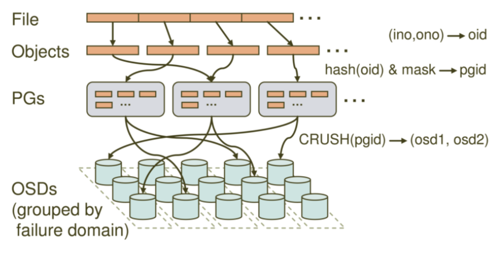

## ceph的构成

- **Pool**：存储池、分区，存储池的大小取决于底层的存储空间。
- **PG(placement group)**：一个 pool 内部可以有多个 PG 存在，pool 和 PG 都是抽象的逻辑概念，一个 pool 中有多少个 PG 可以通过公式计算。
- **OSD(Object Storage Daemon):**每一块磁盘叫做 osd，多个 osd 组成一个主机
- **librados** 是 RADOS 存储集群的 API，支持 C/C++/JAVA/python/ruby/php 等编程语言客户端调用。

## Ceph核心组件及概念介绍

- OSD：实际存储数据的进程。每台存储服务器的磁盘组成的存储空间，通常一个OSD daemon绑定一个物理磁盘。Client write/read 数据最终都会走到OSD去执行write/read操作。
- Monitor：一个Ceph集群需要多个Monitor组成的小集群，它们通过Paxos同步数据，用来保存OSD元数据。
- MDS(ceph 元数据服务器，ceph-mds)：代表 ceph文件系统(NFS/CIFS)存储元数据，

<!--Ceph 块存储和 Ceph 对象存储不使用 MDS-->

- Object：Ceph最底层的存储单元是Object对象，每个Object包含元数据和原始数据。
- PG：PG全称Placement Grouops，是一个逻辑的概念，一个PG包含多个OSD。引入PG这一层其实是为了更好的分配数据和定位数据。
- RBD：RBD全称RADOS block device，是Ceph对外提供的块设备服务。
- RGW：RGW全称RADOS gateway，是Ceph对外提供的对象存储服务，接口与S3和Swift兼容。
- CephFS：CephFS全称Ceph File System，是Ceph对外提供的文件系统服务。

**存储过程：**

存储池要先创建才能往 ceph 保存数据，文件在向 ceph 保存之前要先进行一致性 hash 计算，计算后会把文件保存在某个对应的 PG 的，某个文件一定属于某个 pool 的 PG，在通过 PG保存在 OSD 上。数据对象在写到主 OSD 之后再同步到从 OSD 以实现数据的高可用。

> 第一步：把文件对象映射给 PG
>
> 第二步: 把文件对象映射到OSD，
>
> 第三步：通过 OSD 写入到硬盘

