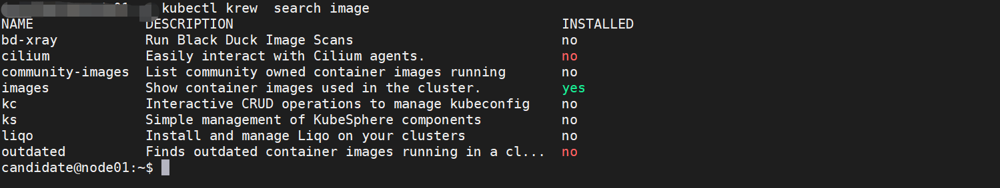

Krew 是一个由 Kubernetes SIG CLI 社区维护的 kubectl 命令行工具的插件管理器，Krew 默认以用户主目录下的隐藏目录 .krew 为工作目录。

Krew 插件索引 所维护的 kubectl 插件并 未经过安全性审查。 安装前需了解安装和运行第三方插件的安全风险。
## 1、安装 git 
```shell
apt-get install git
```
## 2、下载安装 krew
```shell
cat install-krew.sh

#!/bin/bash

(
  set -x; cd "$(mktemp -d)" &&
  OS="$(uname | tr '[:upper:]' '[:lower:]')" &&
  ARCH="$(uname -m | sed -e 's/x86_64/amd64/' -e 's/\(arm\)\(64\)\?.*/\1\2/' -e 's/aarch64$/arm64/')" &&
  KREW="krew-${OS}_${ARCH}" &&
  curl -fsSLO "https://github.com/kubernetes-sigs/krew/releases/latest/download/${KREW}.tar.gz" &&
  tar zxvf "${KREW}.tar.gz" &&
  ./"${KREW}" install krew
)

```
安装完如下图：


## 3、添加 krew 环境变量

```shell
export PATH="${KREW_ROOT:-$HOME/.krew}/bin:$PATH"
```

## 4、查看安装的版本
```shell
 kubectl krew version
```


## 5、kubectl-krew 常用子命令

- help
- list
```shell
# 查看目前已经安装的插件
kubectl plugin list
```


- search
```shell
# 搜索krew索引中包含字符串 image 的插件
kubectl krew  search image 
```


- info
```shell
# 简要描述 images 插件的作用
kubectl krew info images

images: 插件以表格的形式查看此k8s集群中所有使用的镜像，还可以以特定命名空间的形式查看
```


如下图：


- install
```shell
# 安装 Images 插件
kubectl krew install images  
```


- upgrade
- uninstall
```shell
kubectl krew uninstall {插件名}
```
