# KubeClipper简单学习

简介：类似于 Rancher，是一个k8s管理工具。KubeClipper 基于 Kubeadm 封装，可以通过 Web 界面、API，或命令行工具（kcctl）来管理主机节点，可以快速创建和删除 K8S 集群，并可以对已存在的 K8S 集群进行纳管、升级、配置变更、应用部署，以及扩、缩容等操作。

 [项目 Github 地址]([https://github.com/kubeclipper/kubeclipper*](https://github.com/kubeclipper/kubeclipper))

[KubeClipper 官网](https://kubeclipper.io/)

参考链接：[KubeClipper 正式加入 CNCF Sandbox](https://mp.weixin.qq.com/s/eBVQxD17vv91QbADqP_LBw)


## 一、概述


### 1.1、KubeClipper 架构设计

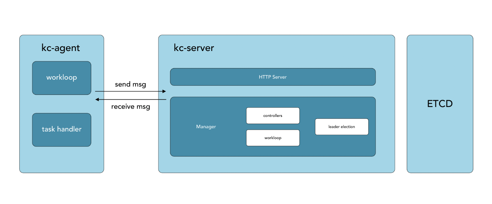

KubeClipper 核心组件：

- kc-server：原则上部署在独立节点，负责收集节点上报信息，分发前端操作任务至指定 kc-agent 并汇总执行结果等，是 KubeClipper 控制核心。
- kc-agent：部署在纳管节点，通过消息队列（内置 nats）与 kc-server 通信，负责上报节点信息以及处理下发任务并执行，是 KubeClipper 节点代理工具。
- Kcctl：KubeClipper 的终端命令行工具，可快捷高效的部署、管理 KubeClipper 集群，能够替代大多数页面操作。
- kc-etcd：kc-server 的后端数据库，跟随 kc-server 部署在同一节点上。
- kc-dashboard：图形化管理界面，跟随 kc-server 部署在同一节点。


## 二、部署

以部署 K8S 为例，借助 KubeClipper 我们只需要一条命令即可完成集群创建。

部署流程如下：

- 1）下载 kcctl 命令行工具
- 2）部署 KubeClipper
- 3）部署 K8S 集群


### 2.1、基础环境配置

```shell
# 修改主机名
hostnamectl set-hostname master
hostnamectl set-hostname node

# 主机映射
vi /etc/hosts

# 安装 wget
dnf install -y wget
```


### 2.2、安装  kcctl  工具

```shell
# 默认安装最新的发行版
curl -sfL https://oss.kubeclipper.io/get-kubeclipper.sh | KC_REGION=cn KC_VERSION=v1.3.4 bash -

# 安装指定版本
curl -sfL https://oss.kubeclipper.io/get-kubeclipper.sh | KC_VERSION=v1.3.1 bash -

kcctl version  # 检查是否安装成功
```

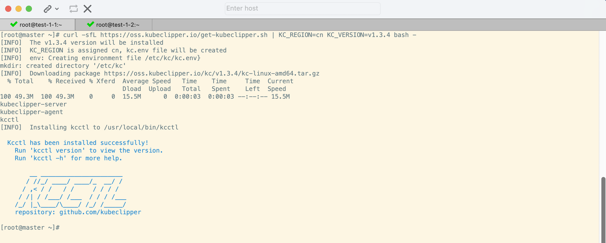


### 2.3、部署 kubeclipper 集群

```shell
# 私钥方式部署
kcctl deploy --pk-file=./.ssh/id_rsa  --server 192.168.1.10 --agent 192.168.1.5
```


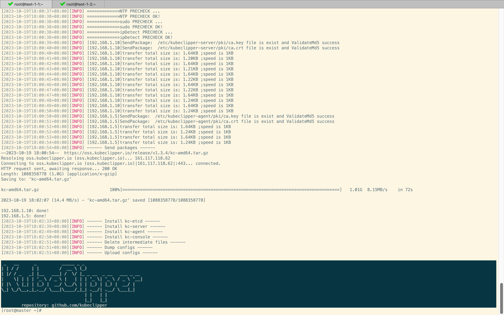


系统默认管理账号：`admin / Thinkbig1`

登录控制台： 打开浏览器，访问 `http://SERVER_IP` （通过任意一个 Server 节点均可访问）即可进入 KubeClipper 控制台


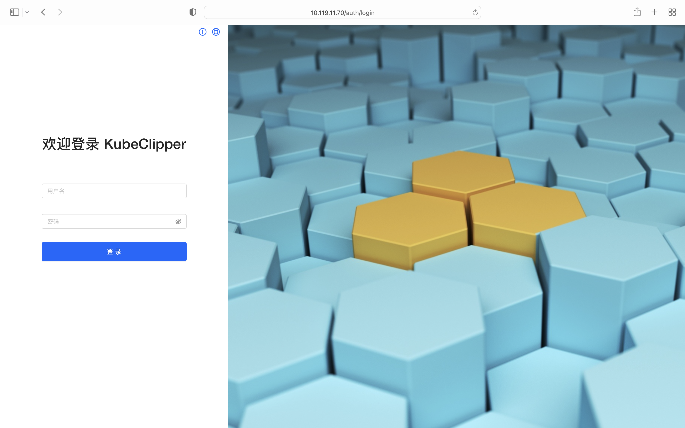成功登陆如下：

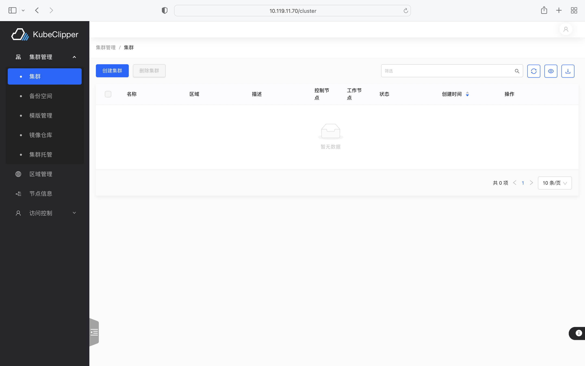


上述 agent 节点只添加了 node 节点，此处我们测试将 master 节点也添加为 agent 节点

Kcctl 命令行添加 agent 节点前，需要先登录命令行：

```shell
kcctl login -H http://192.168.1.10 -u admin -p Thinkbig1

kcctl join --agent=192.168.1.10
```

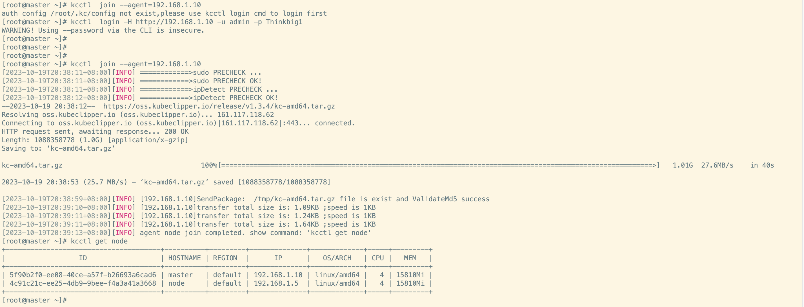


### 2.4、部署 Kubernetes


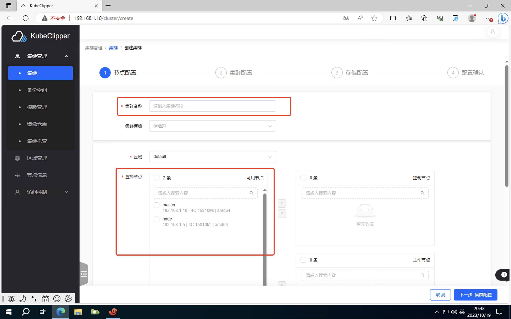


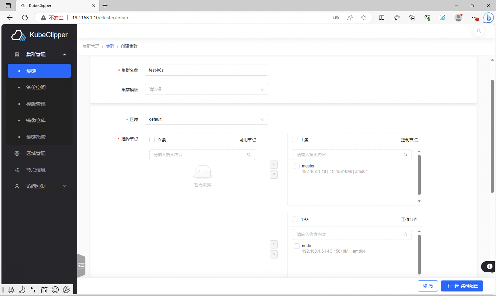


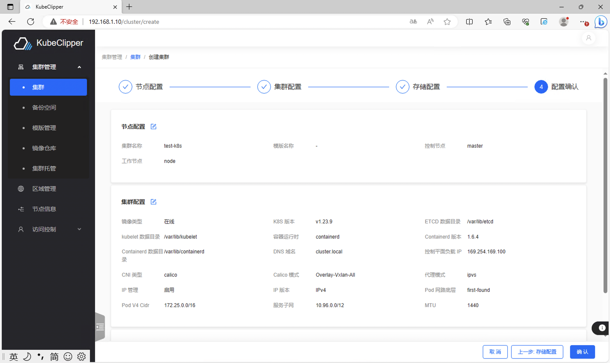


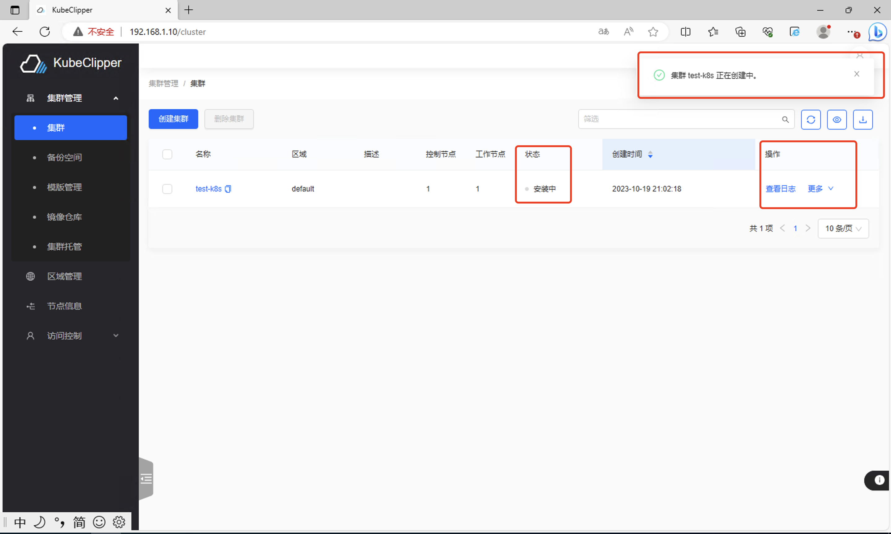


成功安装如下图：

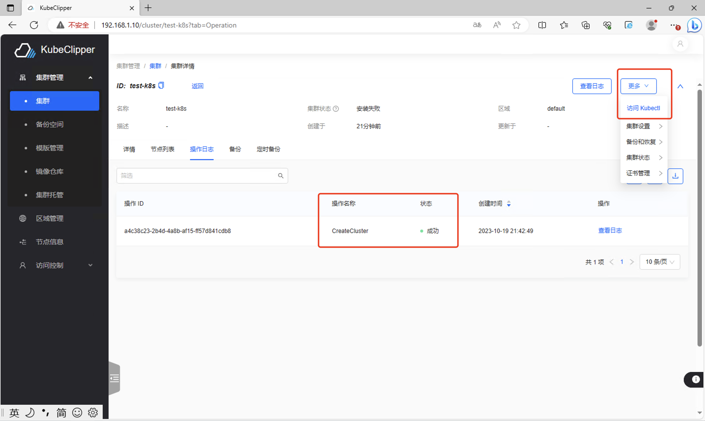


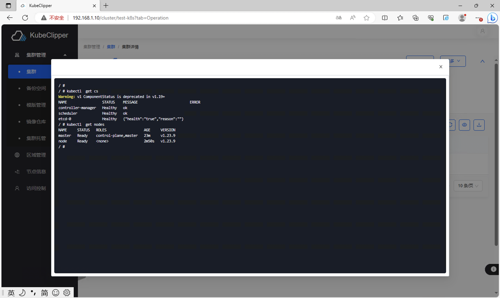


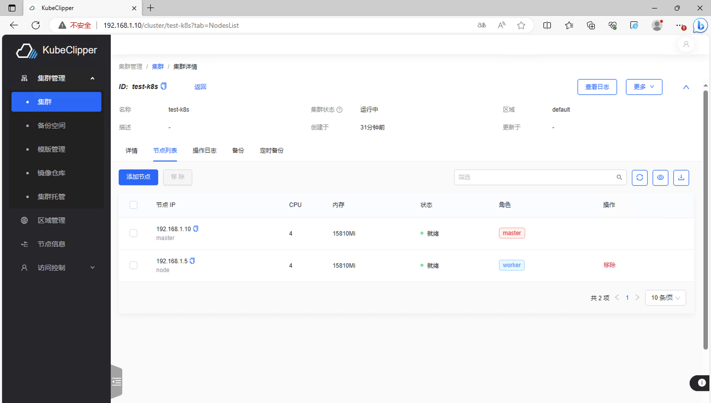

至此，Kubernetes 集群安装完毕


