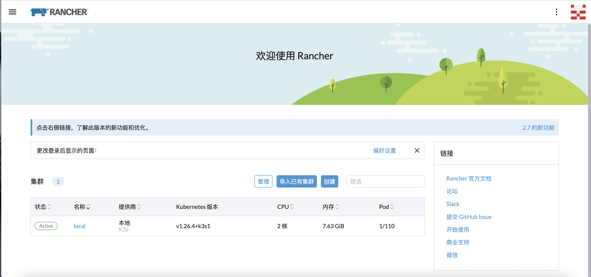

## 环境

- 系统版本：centos 7.9

- rancher 版本：v2.7.6

  

## 安装 docker

```shell
yum install -y yum-utils
yum-config-manager --add-repo http://mirrors.aliyun.com/docker-ce/linux/centos/docker-ce.repo
yum -y install docker-ce  # 直接安装是安装的最新版本
systemctl enable docker --now
```


## 安装 Rancher

```shell
 docker run -d --privileged -p 80:80 -p 443:443 -v /root/docker_volume/rancher:/var/lib/rancher --restart=always --name rancher-2.7.6 rancher/rancher:v2.7.6
```





等待安装大概 10 分钟


安装完成如下图：


页面调用命令行


