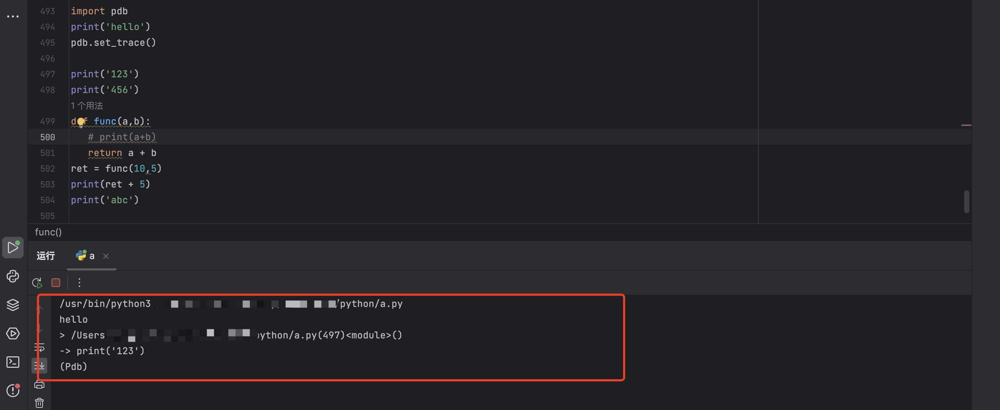
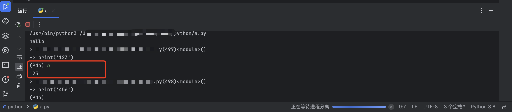
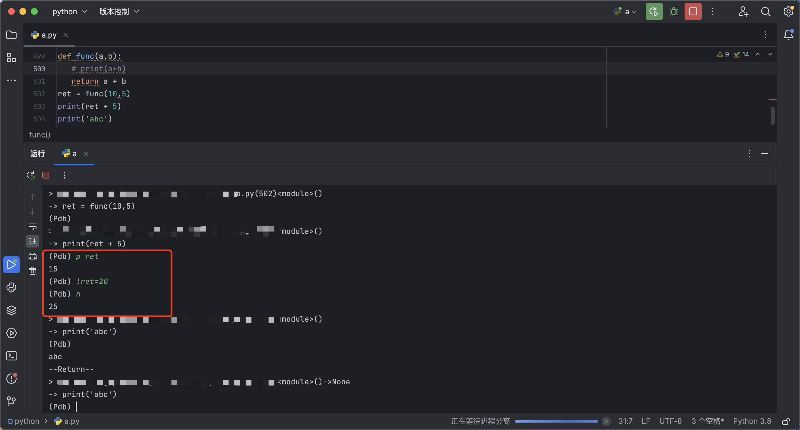

## Python 中使用 pdb 工具代码调试


pdb 是 python 自带的一个包，为 python 程序提供了一种交互式的源代码调试功能。主要特性包括设置断点、单步调试、进入函数调试、查看当前代码、动态改变变量的值等。pdb 提供了一些常用的调试命令，详情见下表


| 命令            | 含义                       |
| --------------- | -------------------------- |
| **list 或 l**   | 查看当前行的代码段         |
| **next 或 n**   | 执行下一行                 |
| **step 或 s**   | 进入函数                   |
| **return 或 r** | 执行代码直到从当前函数返回 |
| **p**           | 打印变量的值               |
| **exit 或 q**   | 中止调试，退出程序         |


### 使用方法

```python
import pdb

pdb.set_trace()   # 在想要断点代码后添加此行
```


### 示例

```python
import pdb
print('hello')
pdb.set_trace()    # 添加断点

print('123')
print('456')
def func(a,b):
   return a + b
ret = func(10,5)
print(ret + 5)
print('abc')
```


程序停在 print('123') 




输入 n 回车，代码将执行下一行 即打印出 123




使用 p 打印出变量的值，如果想重新改变 ret 的赋值，可以使用！

