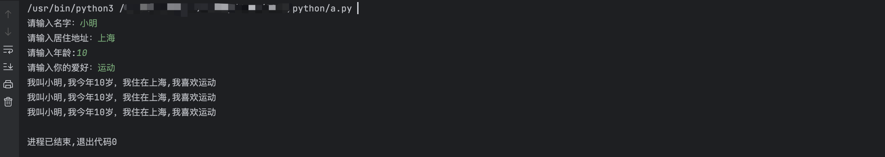
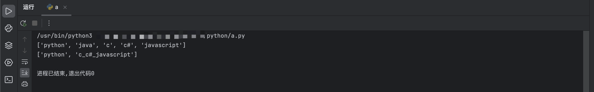
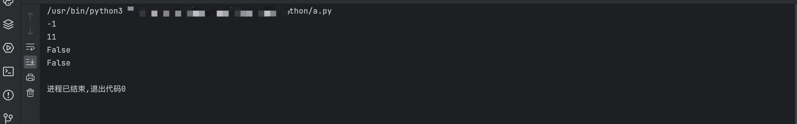
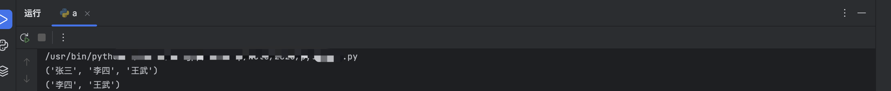
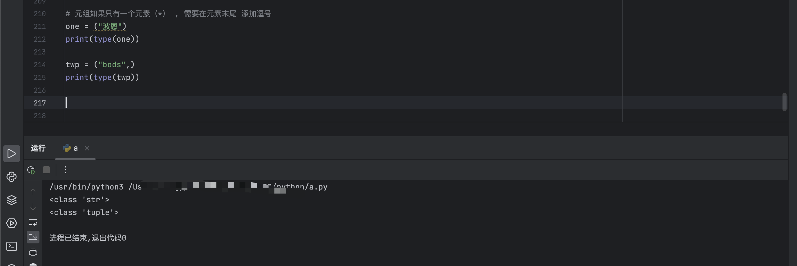

变量 = input(提示语)

input() 得到的结果是字符串类型

# 字符串

## 1、字符串格式化

%s ： 字符串占位

%d :  占位整数

%f :  占位小数

```python
# 我叫 xxx，我住在 xxx，我今年 xxx 岁，我喜欢 xxx
name = input("请输入名字：")
address = input("请输入居住地址：")
age = int(input("请输入年龄:"))
hobby = input("请输入你的爱好：")

s = "我叫%s,我今年%d岁，我住在%s,我喜欢%s" % (name,age,address,hobby)
s1 = "我叫{},我今年{}岁，我住在{},我喜欢{}".format(name,age,address,hobby)
s2 = f"我叫{name},我今年{age}岁，我住在{address},我喜欢{hobby}"  # f-string 格式化法
print(s)
print(s1)
print(s2)

```




## 2、字符串索引和切片

### 索引： 按照位置提取元素

```python
s = "我叫小明"
print(s[0])
print(s[-1])    # - 表示 倒数

程序运行结果：我
            明
```

### 切片：从字符串中提取部分内容

```python
s = "我喜欢打羽毛球，你喜欢干什么"
print(s[3:8])  # 从索引3位置切片，切到8结束: 即程序运行输出 （打羽毛球，你）
```


但实际运行代码发现 输出 为 "打羽毛球，" ，这是为何？

**注意点**：切片 拿不到第二个位置的元素

==语法==：s[start:end]  从 start 到 end 进行切片，但是 取值无法取到 end ，即左闭右开区间 [start,end)

-  如果 start 或 end 是从开始 或 切到结尾 则可省略，即 **左右两边有空白，表示开头或结尾**

```python
print(s[:3])   # 从 0 切到 3
print(s[3:])   # 从 3 切到结尾
```

#### 切片步长：

步长：可以给切片添加步长来控制切片方向

==语法==：`s[start:end:step]`  ： 从 start 切到 end，每 step 个元素出来一个元素

```python
print(s[::-1])  # - : 表示从右往左切
```


## 3、字符串切割和替换

- strip() : 去除字符串左右两端的空白符（空格，\t，\n）

```python
username = input("用户名：").strip()
password = input("密码：").strip()

if username == "admin":
    if password == "123456":
        print("登陆成功")
    else:
        print("登陆失败")
else:
    print("登陆失败")
```

- replace(old, new) : 字符串替换

```python
s = "你好啊，我叫小明"
s1 = s.replace("小明","李杰")
print(s1)

s2 = "A B C   am   boy"
s3 = s2.replace(" ","")   # 去掉空格
print(s3)
```

-  split(用什么切割) ：字符串切割


```python

a = "python_java_c_c#_javascript"
lst = a.split("_")    # 切割之后的结果会放在列表中
print(lst)

# 用什么切就会损失谁

a1 = "python_java_c_c#_javascript"
lst1 = a1.split("_java_")
print(lst1)
```




### 字符串的查找判断

- 查找

find()    存在会返回值，且多为查找的字符串所在的位置，若不存在返回 - 1

index()    存在会返回值，且多为查找的字符串所在的位置，若不存在则报错

in  存在为 true 不存在 false

```python
s = "你好，我叫小明，我喜欢周杰伦"
ret = s.find("周杰伦11")   
print(ret)

ret1 = s.index("周杰伦")  
print(ret1)

# 常见的用法：

print("周杰伦123123" in s)
print("周杰伦" not in s)
```



python基础

- startwith()：判断字符串是以什么开头

```python
name = input("请输入你的名字：")
if name.startswith("张"):
    print("你姓张")
else:
    print("你不姓张")
```

- isdigit() : 判断字符串是否是整数组成

# 列表 list []

在 python 中用 [] 来表示一个列表，列表中的元素通过 “,” 隔开

- 列表像字符串一样有索引和切片
- 索引超过范围会报错
- 用 len() 函数可以获取列表长度

## 列表增删改查 

```python
lst = ["张三","李四","王武"]


# append(): 向列表中添加内容(在列表最后面追加内容)
lst.append("王一")

# insert()： 插入
lst.insert(0,"李明")    # 在 索引0 的位置 插入“李明”

# extend() 合并两个列表，批量添加
lst.extend(["小明","张红"])

print(lst)

# pop(): 给出被删除的索引，返回被删除的元素
ret = lst.pop(0)
print(ret)

# remove(): 删除某个元素
lst.remove("张红")
print(lst)

# 修改 直接用索引就可以修改元素
lst[4] = "妲己"
print(lst)

# 查询 直接用索引就可以查询
print(lst[4])


a = ["张三","李四","王武",'王一', '小明', '张红']

for i in range(len(a)):
    item = a[i]
    if item.startswith("王"):
        new_name = "张"+item[1:]
        print(new_name)
        a[i] = new_name
print(a)
```


## 列表的嵌套


```python
lst = ["123","456","789",["abc","def","ghi",["呼吸","生活"]],"1qa","2ws"]
print(lst)
a = lst[3][3][0]
print(a)

# 运行结果：呼吸
```


# 元组 tuple ()

特点：不可变的列表


```python
t = ("张三","李四","王武")
print(t)

# 切片
print(t[1:3])
```




```python

# 元组如果只有一个元素（*） , 需要在元素末尾 添加逗号
one = ("波恩")
print(type(one))

twp = ("bods",)
print(type(twp))

```




# 集合 set {}

python 中的 set 集合进行数据存储的时候，需要对数据进行哈希计算，根据计算出来的哈希值进行存储数据

**set 集合要求存储的数据必须是可以进行哈希计算的**

可哈希计算：不可变的数据类型：int  str  元组  布尔类型 (bool)

不可哈希：可变的数据类型： list   dict   set

```python
s =  {1,2,3,"yes"}


s1 = set()  # 创建空集合

s1.add("4")   # 添加内容
s1.add("5")
print(s1)

s.remove("yes")   # 删除
print(s)

# 修改： 想要修改，先删除 再添加

# 查询
for item in s:
    print(item)
    
    
s1 = {'刘能','赵四','皮长山'}
s2 = {'1','2','3','刘能'}

# 交集
print(s1 & s2)
print(s1.intersection(s2))

# 并集
print(s1 | s2)
print(s1.union(s2))

# 差集
print(s1 - s2)   # s1 存在，s2 中不存在的
print(s1.difference(s2))

# 最重要的作用：去重复
```


# 字典 dict {:}

字典是以键值对的形式进行存储数据的

字典表示方式：{key:value, key2:value2}

字典的 key 必须是可哈希的数据类型**（不可变的数据类型）**；字典的 value 可以是任何的数据类型


```python
dic = {"jay":"周杰伦","金毛狮王":"谢逊"}

val = dic["jay"]  # 字典的索引 为 键key 的值，返回 key 对应的 value 值
print(val)

运行结果： 周杰伦

dic1 = {():123}

print(dic1)

运行结果：{(): 123}

dic = {"jay":"周杰伦","金毛狮王":"谢逊"}

# 添加
dic['abc'] = '123'
print(dic)

运行结果：{'jay': '周杰伦', '金毛狮王': '谢逊', 'abc': '123'}

# 修改
dic['jay'] = '昆凌'
print(dic)

运行结果：{'jay': '昆凌', '金毛狮王': '谢逊', 'abc': '123'}

# 删除
dic.pop("abc")
print(dic)

运行结果：{'jay': '昆凌', '金毛狮王': '谢逊'}

# 查询
print(dic['jay'])  # 如果 key 不存在，程序会报错
print(dic.get('jay'))  # 如果 key 不存在，程序会返回 None

运行结果：
昆凌
昆凌
```


## 字典的循环与嵌套


### 循环

```python
dic = {
    "1":"2",
    "3":"4",
    "5":"6"
}


# for 循环,直接拿到 key
for item in dic:
    print(item,dic[item])
    
运行结果：
1 2
3 4
5 6

# 把所有的 key 全都保存在一个列表中
print(list(dic.keys()))

运行结果：
['1', '3', '5']


# 把所有的 value 全都保存在一个列表中
print(list(dic.values()))

运行结果：
['2', '4', '6']

# 直接拿到字典中的 key 和 value
print(list(dic.items()))

运行结果：[('1', '2'), ('3', '4'), ('5', '6')]

for item2   in dic.items():
    print(item2)
    
运行结果：
('1', '2')
('3', '4')
('5', '6')


# 元组或列表都可以执行该操作，该操作被称为解构（解包）

a,b = (1,2)
print(a)
print(b)

运行结果：
1
2

for key,value in dic.items():
    print(key,value)

运行结果：
1 2
3 4
5 6

```


### 嵌套

```python
students = {
    'kelvin': {
        'age': 18,
        'course': ['数据结构', '计算机网络', '计算机组成原理', '操作系统']
    },
    'vicky': {
        'age': 19,
        'course': ['xx经济学', '西方经济学', '统计学', '发展经济学']
    }
}

print(students['vicky']['course'][1])

运行结果：西方经济学

for name,student in students.items():
     print('姓名:',name,",年龄：",student['age'],",课程：")
     for course  in  student['course']:
         print(course)
 
运行结果：
姓名: kelvin ,年龄： 18 ,课程：
数据结构
计算机网络
计算机组成原理
操作系统
姓名: vicky ,年龄： 19 ,课程：
xx经济学
西方经济学
统计学
发展经济学
```


# 文件操作

- 找到这个文件，并打开它

`open(文件路径,mode='',encoding='')`

```python


示例：# 读取文件内容

f = open("acd ",mode='r',encoding='utf-8')

content = f.read()
print(content)


# 读取一行
line = f.readline()
print(line)

# 读取所有内容，存放在列表里
line = f.readlines()
print(line)
```

`mode：r： read 读取`

​            `w:  write 写`    

- w 模式下，如果文件不存在，自动会创建一个文件
- w 模式下 每一次open都会清空掉文件的内容

​           `a:  append 追加写入`

​           `b: 读写的是非文本文件`  例如：图片等

```python
lst = ['wan','wdc','xerv','def']
f = open('acd',mode='r',encoding='utf-8')
#f.write(lst[0])

#f.write('王翼')

a = f.readlines()
print(a)

```


**with ：上下文 不需要手动的关闭一个文件**


```python
with open('acd',mode='r',encoding='utf-8') as f :    # f = open()

  for item in f:
    print(item) 
    
 运行结果：wan王翼
```


# 条件判断

## if 语句的语法规则：

```python
1、

if 条件:
   代码       
  
2、

if 条件:
   代码
else:
   代码
    
# 示例：    
money = 100
if money > 300:
    print(123)
else:
    print(890)
    
    
3、if 嵌套

if 条件:
  if ....:
     代码
  else:
     代码
else:
   代码

# 示例：
money = int(input("请输入钱包余额："))
if money > 1000:
    if money > 2000:
        print("充个会员卡")
    else:
        print("吃顿饭就走")
else:
    print("回家挣钱")

4、
if 条件:
  代码1
elif 条件2:
  代码2
elif 条件3:
  代码3
 
...
else:
  代码
  
# 示例：  
money = int(input("请输入钱包余额："))
if money > 1000:
   print("充卡")
elif money > 500:
    print("回家")
else:
    print("工作")

```


# 循环语句

## 1、while 循环的语法规则：

```python
# 过程: 判断条件是否为真，如果是真，执行代码，然后再次判断条件，直到条件为假
while 条件:
   代码
    
# 示例: 
while True:    # 死循环
    print(123)
    
a = 1             # 打印1到100
while a <=100:
    print(a)
    a = a + 1

 
a = 1             # 计算 1到100 相加和
s = 0
while a <=100:
     # print(a)
    a = a + 1
    s = s + a
print(s)

```


## 2、for 循环的语法规则：

```python
for 变量 in 可迭代的东西:
    代码
把可迭代的东西中的每一项内容拿出来

for循环想要计数，必须借助于 range
range(n): 从0数到n,不包含n
range(m,n): 从m数到n，不包含n
range(m,n,s): 从m数到n，不包含n，步长s

for i in range(1,10,3):
    print(i)
```


## 3、break 和 continue

break： 让当前的循环立即停止

```python
while True:
    content = input("请输入你想说的话：（输入q 停止循环）")
    if  content == "q":
        break
    print("我想说：",content)
```

continue: 停止当前循环，继续执行下一循环

```python
i = 1
while i <= 10:
    if i == 4:
       i = i + 1
       continue      
    print(i)
    i = i + 1
```


### pass

代码占位


# 函数

函数：对某一个特定的功能或者代码块进行封装，在需要使用该功能时直接调用即可

```python

# 定义一个函数

def 函数名():
    被封装的功能或者代码块 ---> 函数体

# 调用

函数的名字()

# 示例：

def test():
    print('1')
    print('2')
    print('3')

test()
```


参数：可以在函数调用的时候，给函数传递信息

**分类：1、形参：在函数定义时，需要准备一些变量来接收信息**

形式参数是在定义函数时使用的。 形式参数的命名只要符合“标识符”命名规则即可。

​            **2、实参：实际调用时传递的信息**

在调用函数时，传递的参数称为“实际参数”，简称“实参”。


```python
def test(a): # 形参
    print('1',a)
    print('2')
    print('3')

test('ced')  # 实参
```


```python
# 示例：

def jisuan(a,option,b):
    if option == "+":
        print(a+b)
    elif option == "-":
        print(a-b)
    elif option == "*":
        print(a*b)
    elif    option == "/":
        print(a/b)
    else:
        print("啥也不是")

jisuan(2,"+",3)

运行结果：5
```


## 实参的分类

- 位置参数：按照位置进行传递参数
- 关键字参数：按照参数的名字进行传参
- 混合参数：

​               顺序：位置参数放前面，关键字参数放后面


```python
def eat(zhu,fu,tang,tian):
    print(zhu,fu,tang,tian)

eat("米饭","紫米","紫菜汤","蛋糕")   # 位置传参

eat(zhu="黄米",tang="冬瓜汤",fu="黑米",tian="奥利奥")  # 关键字参数

eat("黄米","冬瓜汤",tang="黑米",tian="奥利奥")  # 混合参数

运行结果：
米饭 紫米 紫菜汤 蛋糕
黄米 黑米 冬瓜汤 奥利奥
黄米 冬瓜汤 黑米 奥利奥
```


## 形参的分类

- 位置参数
- 默认值参数：在函数声明时给变量一个默认值，如果实参不传递信息，此时默认值生效，否则不生效

```python
def luru(name,age,gender="男"):  # 默认值参数
    print(name,age,gender)
luru("张三",19)

luru("李三",10)
luru("王一",39,"女")
```

- 动态传参

1. *args，表示接收所有的位置参数的动态传参

```python
def eat(*food):  # * 表示位置参数的动态传参，* 号接收到的值会被统一放在一个元组里
    print(food)
eat("米饭","紫米","紫菜汤","蛋糕")
```

1. **kwargs, 表示接受所有关键字的动态传参

```python
def test(**food):  # ** 表示接受关键字的动态传参，接收到的值会被处理成字典
    print(food)
test(fu="黑米",tian="蛋糕")
```


**顺序：位置 > *args > 默认值 > ****kwargs


```python
stu_lst = ["12","34","56","78","90"]

def fun(*args):
    print(args)

#fun(stu_lst[0],stu_lst[1])

fun(*stu_lst)    #  *在实参位置，把列表打散成位置参数进行传递
                 #  **在实参位置，把字典自动转化成关键字参数进行传递
```


## 函数返回值


如果函数内没有return，此时外界接收到的是none
如果写了 return
1、只写了 return 后面不跟数据，此时接收到的依然是 none
2、return 值，此时表示函数有一个返回值，外界能够接收到一个数据
3、return 值1，值2，值3.....，此时函数有多个返回值，外界收到的是元组，并且元组内存放所有的返回值


```python
def func(a,b):
   # print(a+b)
   return a + b
ret = func(10,5)
print(ret + 5)
```


## 函数的嵌套

- 函数可以作为返回值进行返回
- 函数可以作为参数进行互相传递

函数名实际上就是一个变量名，都表示一个内存地址


## global 和 nonlocal


```python
a = 10
def fun():

# 此时想在函数内部修改全局的变量 a 的值

   global a   # 把外面的全局变量引入到局部
   a = 20
fun()

print(a)
```


```python
def fun():
   a = 10
   def fun2():
      nonlocal a   # 向外找一层，看看有没有该变量，如果有就引入，没有就继续向外一层，直到全局（不包括）
      a = 20
   fun2()
   print(a)
fun()
```


## 闭包


## Python 内置函数


### print 函数

print 可以输出数字、字符串（必须加引号）、含有运算符的表达式（会计算表达式结果）

```python
print(123)    # 123
print("hello print")   # hello print 
print(1+1)    # 2 
```

print（）还可以将内容输出到目的地

```python
# 将hello输出到文件/Users/wangpp/Desktop/python.txt，若文件不存在则新建

test=open("/Users/wangpp/Desktop/python.txt","a+")
print("hello",file=test)
test.close()
```


### open 函数

Python 内置函数 open() 用于打开一个文件，创建一个 **file** 对象，相关的方法可以调用它进行读写

语法：

```python
file object = open(file_name [, access_mode][, buffering])
```

参数说明：

- name : 一个包含了你要访问的文件名称的字符串值。
- mode : mode 决定了打开文件的模式：只读，写入，追加等。所有可取值见如下的完全列表。这个参数是非强制的，默认文件访问模式为只读(r)。
- buffering : 如果 buffering 的值被设为 0，就不会有寄存。如果 buffering 的值取 1，访问文件时会寄存行。如果将 buffering 的值设为大于 1 的整数，表明了这就是的寄存区的缓冲大小。如果取负值，寄存区的缓冲大小则为系统默认。

#### （1）File对象的属性

一个文件被打开后，就有一个file对象，我们可以得到有关该文件的各种信息。

以下是和file对象相关的所有属性的列表：

| 属性           | 描述                                                         |
| :------------- | :----------------------------------------------------------- |
| file.closed    | 如果文件已被关闭返回true，否则返回false。                    |
| file.mode      | 返回被打开文件的访问模式。                                   |
| file.name      | 返回文件的名称。                                             |
| file.softspace | 如果用print输出后，必须跟一个空格符，则返回false。否则返回true。 |

#### （2）File.close()方法

关闭文件


len() ： length 字符串长度

join() : 


