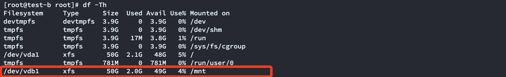

## 磁盘挂载报错 wrong fs type bad option bad superblock

```shell
[root@test-b ~]# mount /dev/vdb1  /mnt/
mount: wrong fs type, bad option, bad superblock on /dev/vdb1,
       missing codepage or helper program, or other error

       In some cases useful info is found in syslog - try
       dmesg | tail or so.
```


网上搜索资料发现 是由于机器中的磁盘uuid冲突所致，因此我查看了当前机器上的磁盘 uuid

```shell
[root@test-b ~]# lsblk -f
NAME   FSTYPE  LABEL    UUID                                 MOUNTPOINT
sr0    iso9660 config-2 2023-07-31-06-42-51-00               
vda                                                          
└─vda1 xfs              e2c1b720-e7b2-4d2d-860d-35c3b3885ba0 /
vdb                                                          
└─vdb1 xfs              e2c1b720-e7b2-4d2d-860d-35c3b3885ba0 
```

发现我挂载的vdb磁盘的uuid和当前机器系统盘uuid一样，而后查阅解决方法有两种：

- 方法一：忽略uuid的挂载方式，mount禁用uuid

```shell
[root@test-b ~]# mount -o  nouuid /dev/vdb1 /mnt/
[root@test-b ~]# ll
total 0
[root@test-b ~]# cd /mnt/
[root@test-b mnt]# ll
total 16
lrwxrwxrwx.  1 root root    7 Dec 13  2021 bin -> usr/bin
dr-xr-xr-x.  5 root root 4096 Dec 13  2021 boot
drwxr-xr-x.  2 root root    6 Dec 13  2021 dev
drwxrwxrwx. 77 root root 8192 Jul 31 06:44 etc
drwxr-xr-x.  2 root root    6 Apr 11  2018 home
lrwxrwxrwx.  1 root root    7 Dec 13  2021 lib -> usr/lib
lrwxrwxrwx.  1 root root    9 Dec 13  2021 lib64 -> usr/lib64
drwxr-xr-x.  2 root root    6 Apr 11  2018 media
drwxr-xr-x.  2 root root    6 Apr 11  2018 mnt
drwxr-xr-x.  2 root root    6 Apr 11  2018 opt
drwxr-xr-x.  2 root root    6 Dec 13  2021 proc
dr-xr-x---.  4 root root  167 Jul 31 06:45 root
drwxr-xr-x.  2 root root    6 Dec 13  2021 run
lrwxrwxrwx.  1 root root    8 Dec 13  2021 sbin -> usr/sbin
drwxr-xr-x.  2 root root    6 Apr 11  2018 srv
drwxr-xr-x.  2 root root    6 Dec 13  2021 sys
drwxrwxrwx   3 root root   19 Jul 13  2021 titan
drwxrwxrwt.  7 root root  110 Jul 31 06:42 tmp
drwxr-xr-x. 13 root root  155 Dec 13  2021 usr
drwxr-xr-x. 20 root root  285 Jul 31 06:46 var
```

- 修改uuid 

（xfs文件系统）：xfs_admin  -U 

（ext2、3、4文件系统）：tune2fs  -U  

```shell
[root@test-b ~]# lsblk -f
NAME   FSTYPE  LABEL    UUID                                 MOUNTPOINT
sr0    iso9660 config-2 2023-07-31-06-42-51-00               
vda                                                          
└─vda1 xfs              e2c1b720-e7b2-4d2d-860d-35c3b3885ba0 /
vdb                                                          
└─vdb1 xfs              e2c1b720-e7b2-4d2d-860d-35c3b3885ba0 
[root@test-b ~]# uuidgen
1d10ce1a-e038-4e30-9878-11d3dcb4f79a
[root@test-b ~]# xfs_admin -U 1d10ce1a-e038-4e30-9878-11d3dcb4f79a  /dev/vdb1
Clearing log and setting UUID
writing all SBs
new UUID = 1d10ce1a-e038-4e30-9878-11d3dcb4f79a
[root@test-b ~]# lsblk -f
NAME   FSTYPE  LABEL    UUID                                 MOUNTPOINT
sr0    iso9660 config-2 2023-07-31-06-42-51-00               
vda                                                          
└─vda1 xfs              e2c1b720-e7b2-4d2d-860d-35c3b3885ba0 /
vdb                                                          
└─vdb1 xfs              1d10ce1a-e038-4e30-9878-11d3dcb4f79a 
[root@test-b ~]# 
```

测试两种方法都可以成功挂载


