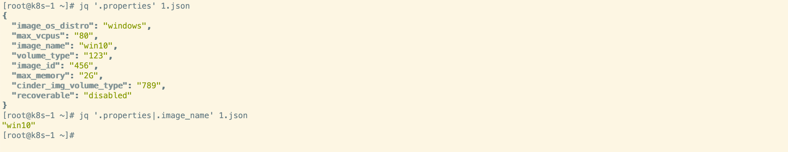

jq 是一个轻量级的命令行工具，专门用于处理和查询 JSON 数据

### 安装方法

```shell
yum -y install jq
```


### 基本语法

```shell
jq [options] filter [file...]
```

其中，options 是可选的参数，filter是 jq 脚本，file是待处理的 JSON 文件。可以省略file参数，这样jq将从标准输入中读取JSON数据


#### 选项（options）

jq命令可以接受一些可选参数（Options），以改变其行为和输出结果的格式。以下是一些常用的选项

- `-c`：将输出结果以紧凑的格式输出，取消掉换行。
- `-r`：将输出结果以原始格式输出，取消掉JSON字符串的引号。
- `-s`：将输入合并成一个数组，用于处理包含多个JSON对象的文件。
- `-M`：禁用内存优化模式，适用于处理较大的JSON文件。

可以通过运行 `jq --help` 命令查看所有可用选项及其说明。

####  过滤器（Filter）

过滤器（Filter）是一个jq脚本，用于定义对输入数据的处理和转换规则。可以使用各种操作和函数来选择、过滤、修改以及格式化JSON数据。

- `.`：表示当前对象。可以使用`.`来访问对象的属性。
- `[]`：表示索引或迭代。可以使用`[]`来访问数组元素或迭代JSON对象属性。
- `|`：表示管道操作。可以使用`|`将多个过滤器连接在一起，实现逐步处理数据。
- `select()`：用于根据条件筛选元素。
- `map()`：用于对数组中的每个元素应用同一个转换。


## 用例演示

原文件如下

```shell
 {
  "properties": {
    "image_os_distro": "windows",
    "max_vcpus": "80",
    "image_name": "win10",
    "volume_type": "123",
    "image_id": "456",
    "max_memory": "2G",
    "cinder_img_volume_type": "789",
    "recoverable": "disabled"
  },
  "security_groups": [
    {
      "name": "default"
    }
  ],
  "user": [
    {
    "name": "John Doe",
    "age": 30,
    "email": "johndoe@example.com"
     },
    {
    "name": "Jane Smith",
    "age": 25,
    "email": "janesmith@example.com"
     }
  ]
}
```


#### 选择属性：

我们可以使用jq命令选择和提取特定的属性。例如要获取"properties"属性的值，可以运行以下命令

```shell
jq '.properties' test.json

jq '.properties|.image_name' 1.json
```




#### 过滤元素：

如果JSON数据是一个数组，我们可以使用jq命令过滤元素，例如：过滤出年龄大于等于30的元素

```shell
[root@k8s-1 ~]# jq '.user' 1.json 
[
  {
    "name": "John Doe",
    "age": 30,
    "email": "johndoe@example.com"
  },
  {
    "name": "Jane Smith",
    "age": 25,
    "email": "janesmith@example.com"
  }
]
[root@k8s-1 ~]# jq '.user|.[]' 1.json 
{
  "name": "John Doe",
  "age": 30,
  "email": "johndoe@example.com"
}
{
  "name": "Jane Smith",
  "age": 25,
  "email": "janesmith@example.com"
}

[root@k8s-1 ~]# jq '.user|.[]|select(.age>=30)' 1.json 
{
  "name": "John Doe",
  "age": 30,
  "email": "johndoe@example.com"
}
```
